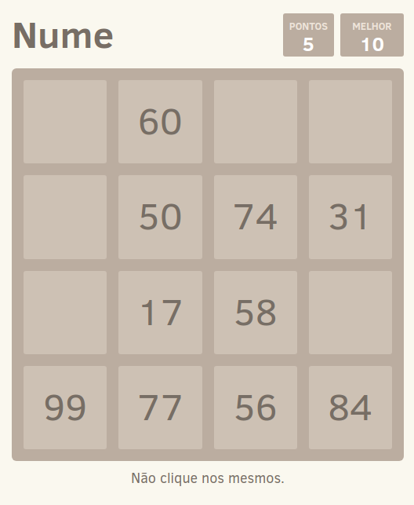

# Nume

[](https://github.com/brtmvdl/apply/blob/main/.github/workflows/docker-push.yml) [](https://github.com/brtmvdl/apply/actions/workflows/docker-push.yml) [](https://github.com/brtmvdl/apply/actions/workflows/github-release.yml) [](https://img.shields.io/github/license/brtmvdl/apply)  [](https://img.shields.io/github/stars/brtmvdl/apply?style=social)

<a href="http://nume.tarsis.cc/">
  
</a>

# How to

## Configuração (desenvolvimento)

Instale o [Node.js](https://nodejs.org/en/) e o [Yarn](https://yarnpkg.com/)

Clone esse repositório

```sh
git clone https://github.com/tmvdl/nume.git

cd nume
```

Instale as dependências do projeto

```sh
yarn
```

Inicie o projeto

```sh
yarn start
```

Visualize no navegador

http://localhost:4200/

## Configuração (Docker)

```sh
docker run -d -p 80:80 tmvdl/nume
```

## License

[MIT](./LICENSE)
